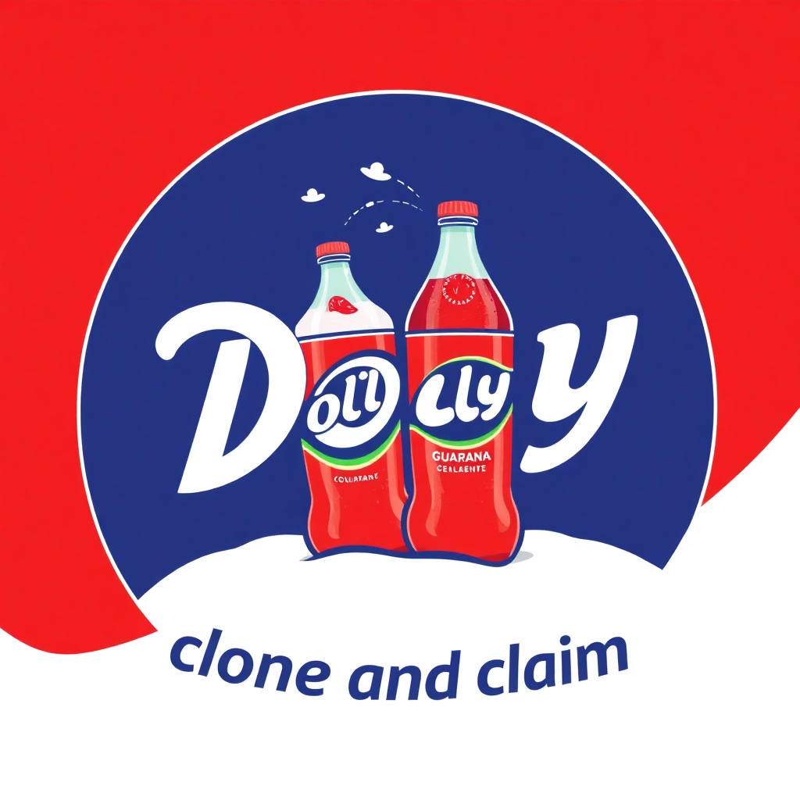

# Clone and Claim

A script designed for interviews to let candidates quickly copy a project template for code challenges.
Instead of starting from scratch, candidates can clone the template, repoint it to their own repository, and begin coding immediately. 

### Usage Instructions

1. **Create a GitHub Repo**  
   - Set up a repo with a sample project, including all necessary frameworks and libraries.

2. **Add this Repo as a Submodule**
   ```bash
   git submodule add git@github.com:CoinBR/clone_and_claim.git submodules/clone_and_claim
   ```
3. **Add a `README.md`**  
   - Use [this template](https://github.com/CoinBR/code_challenge_job_7792/blob/master/README.md) for the `README.md`.  

4. **Create `README.md.candidate`**  
   - Copy `README.md` to `README.md.candidate` and remove the top tips (everything that has the ">" prefix).

5. **Add `setup_repo.sh`**
   - Just copy [this file](https://github.com/CoinBR/code_challenge_angular/blob/master/setup_repo.sh) to the the project root.

6. **Add `run.sh`**  
   - Create a `run.sh` script in the root folder.  
   - Make it executable:  
     ```bash
     chmod +x run.sh
     ```  
   - The script should:  
     - Install dependencies  
     - Start the app  
     - Output the app URL (e.g., `http://localhost:3000`)  


